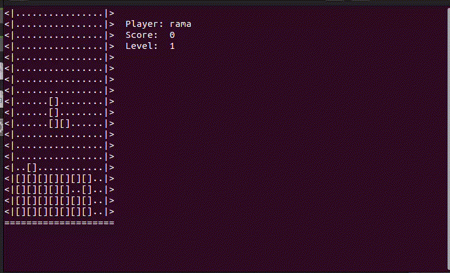
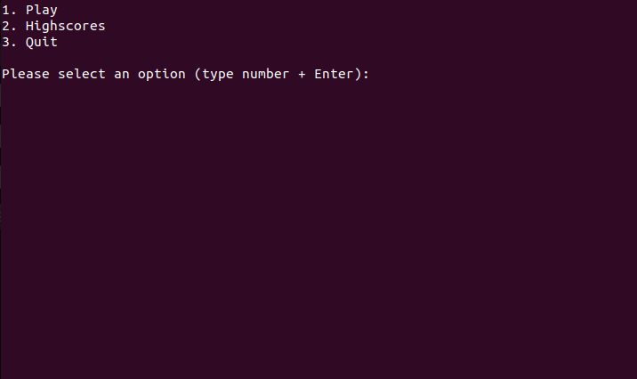
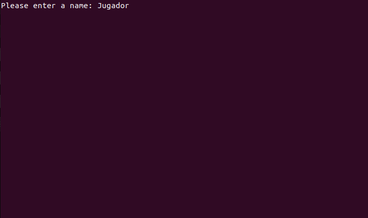
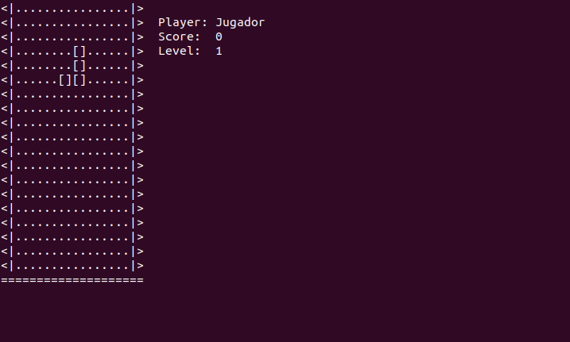
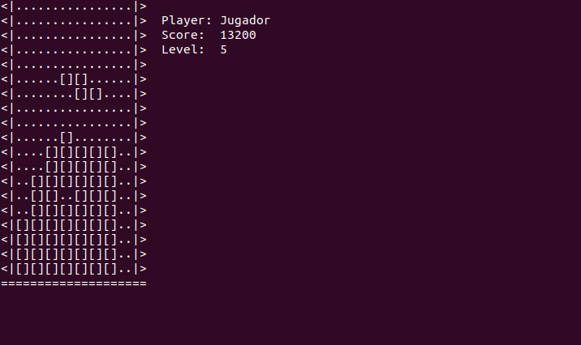
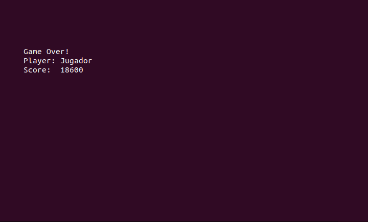
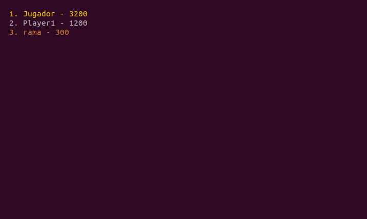

# Terminal Tetris
This is a little project I made to challenge myself. The idea was to create from scratch the original Tetris using only standard libraries for C++.




## What you need
* **C++17** libraries or higher
* **GNU Make 4.3** or higher for compiling
* A **Unix** distro so you can use Make

## Installing
Inside the directory where you'll have the game, open a terminal and enter
```
~/your/main/directory$ make all
```
to compile the game. Once the executable is done simply run

```
~/your/main/directory$ ./tetris
```
to play the game.

**Note:** you may have to give permission to the compiled file to run as an executable. To do that simply enter

```
~/your/main/directory$ chmod +x tetris
```

## Controls
* **A/D** - Move left or right
* **S** - Move down faster
* **Space** - Rotate piece

## Screenshots






